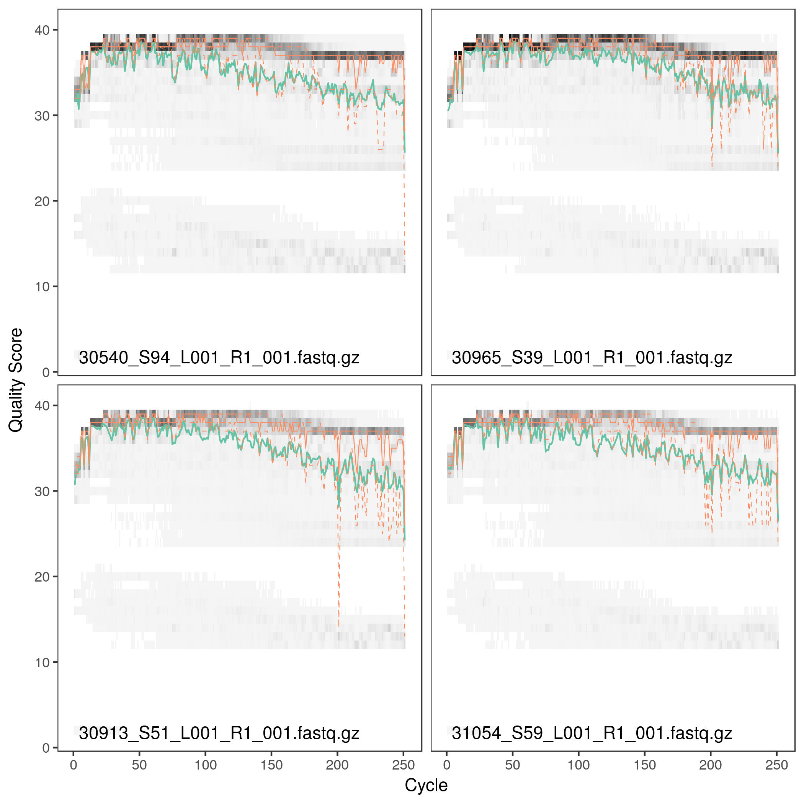
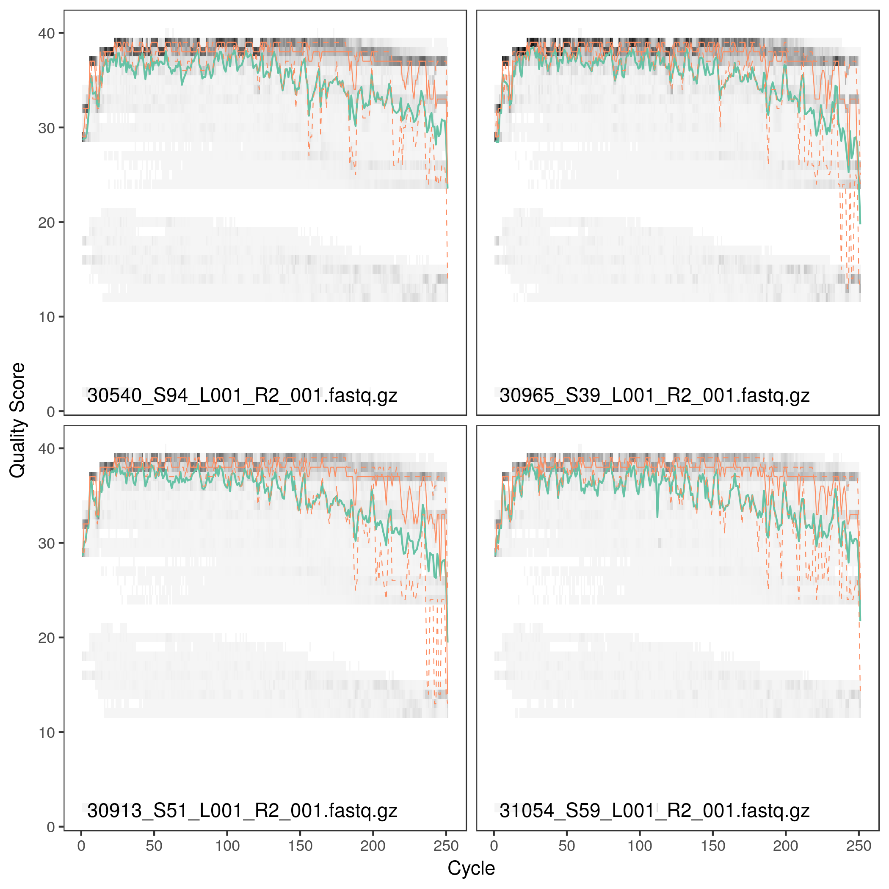

## Step 0: Raw data to sequence variants

### Trimming and filtering

This was done using the `filterAndTrim` method from dada2. >75% of reads pass
the filters.

Some examples of typical quality plots:

**Parameters**:

- trimLeft: 10bp (standard for Illumina)
- truncLen: 240 and 200 (forward and reverse)
- maxEE: 2 (max expected errors in read using the Illumina error model)

### Sequence variants

**source file(s)**: `build_taxonomy.R`

Basically goes all the way from filtered FastQ to sequence variants + taxonomy.

**Parameters**:

- number of random reads to train error rates: 2e6 (DADA2 recommends 1e6 or more)

**Comments:**

- error models are fitted to each run individually as recommended by Ben
- there are many bimeras, however most of the reads are kept after bimera-removal
  (> 70%)
- taxonomy assignment uses RDP with the SILVA DB v128
- final product is a [phyloseq](https://joey711.github.io/phyloseq/) object
